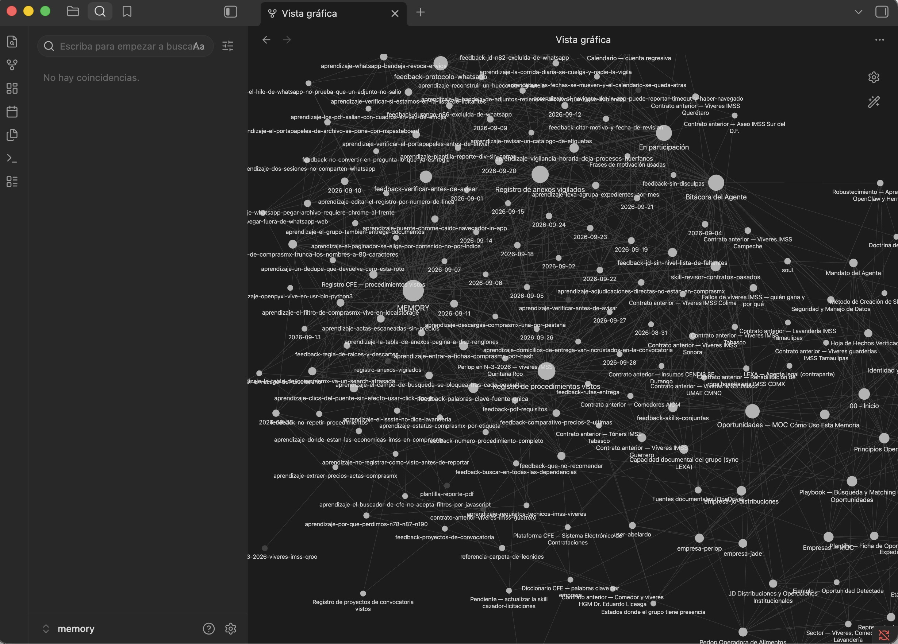
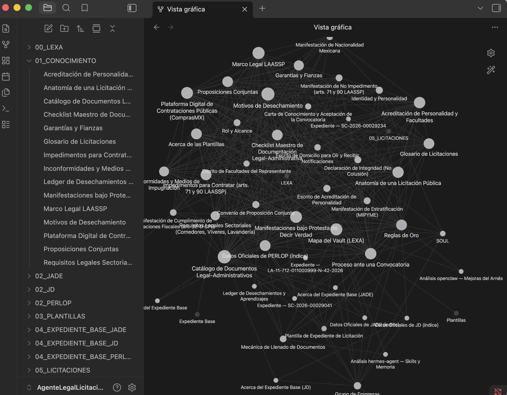

🌐 **Language:** [Español](README.md) | English

# 🤖 AI Agent System for Perlop Operadora de Alimentos

> AI agent system (powered by Claude) for automating the search, tracking, and document filling process in public tender procedures, later expanded to other areas of the company.

📸 *Screenshots of the knowledge base (Obsidian) below — due to company confidentiality policy, the source code is not public.*

---

## 📋 Overview

As IT Systems Manager at Perlop Operadora de Alimentos, I led the implementation of AI agents (Claude) to optimize internal processes, starting with the tender/bidding area and later expanding to Accounting and Human Resources.

Each agent has its own knowledge base (memory) that grows richer over time: the more information it's fed, the better it understands context, tone, and the expected way of working — functioning somewhat like a "personality" that grows with use.

## 👨‍💻 My Role

I was responsible for the company's **IT systems and infrastructure**, supporting more than 50 users (on-site and remote), and I independently led the design, development, and configuration of every AI agent implemented:

- Designed and configured AI agents with Claude to automate repetitive tasks in the tender/bidding area.
- Developed an agent that **monitors daily (9:00 am)** for new public tenders relevant to the company, and sends a status notification via WhatsApp:
  - If a new tender is found: it sends the tender number, automatically downloads it into a folder, and generates a general report on which documents need to be updated.
  - If none is found: it still sends a notification confirming there were no results that day.
- Developed an agent (**LEXA**) specialized in **automatically filling out the legal documentation** required for each tender.
- Designed additional agents to complete the technical and financial documentation for each process.
- Expanded the implementation to other areas of the company (Accounting, Human Resources) once results were validated.
- Also developed 5 additional agents for personal use by senior management.
- Result: up to a 50% reduction in time spent on these processes.

## 🛠️ Tech Stack

| Category | Technology |
|---|---|
| AI / Agents | Claude (Anthropic) |
| Knowledge base | Obsidian |
| Notifications | WhatsApp (automation) |
| Process automation | Custom agents |

## 📸 Screenshots

<table>
  <tr>
    <td align="center"><b>Tender Agent — Memory</b></td>
    <td align="center"><b>LEXA Agent — Legal Knowledge Base</b></td>
  </tr>
  <tr>
    <td></td>
    <td></td>
  </tr>
</table>

## 🔒 Note on Source Code

Due to the company's confidentiality policy, the agents' source code cannot be published. This repository documents the project as a case study, showing the knowledge base structure and the system's functional scope.

---

📩 Questions about this project? Contact me: andymtya93@gmail.com
